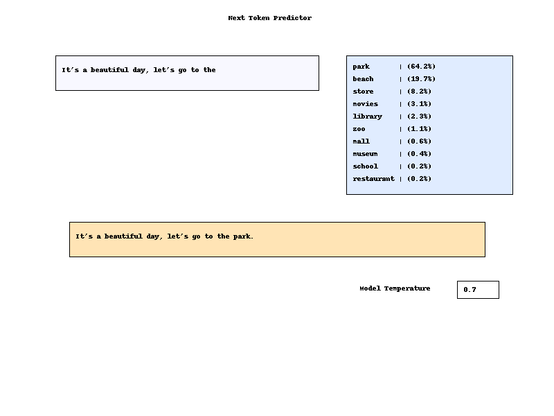

# Next Token Predictor

🚀 **Next Token Predictor**

A simple, interactive Python tool for predicting the next token in a text sequence using OpenAI's GPT model. This project is designed for educational purposes, NLP experimentation, and as a potential foundation for more advanced AI projects.



## Features

- 🧠 Predicts the next token in a user-provided text sequence
- Uses OpenAI's GPT model to predict the next token in your sequence
- Clean, user-friendly interface (see screenshot above)
- Easy to extend and customize for your own experiments

## Getting Started

### Prerequisites

- Python 3.8+

### Installation

1. Clone this repository:

   ```sh
   git clone https://github.com/m2web/next-token-predictor.git
   cd next-token-predictor
   ```

2. (Optional) Create and activate a virtual environment:

   ```sh
   python -m venv venv
   .\venv\Scripts\activate
   ```

3. Install dependencies (if any):

   ```sh
   pip install -r requirements.txt
   ```

### Usage

Run the predictor:

```sh
python next_token_predictor.py
```

Follow the on-screen instructions to input your text and see the predicted next token.
Follow the on-screen instructions to input your text and see the predicted next token. The app will display the top predicted next tokens and their probabilities, as provided by the OpenAI model.

## Project Structure

```text
├── next_token_predictor.py                # Main application (OpenAI GPT-based predictor)
├── next_token_predictor_corrected.py      # Improved/corrected version (also OpenAI GPT-based)
├── next-token-predictor-old.py            # Legacy version (OpenAI GPT-based, CLI)
├── chat-bubble.py                         # UI/utility module
├── assets/
│   ├── final_next_token_predictor_ui.png  # UI screenshot
│   └── token-predictor.drawio.pdf         # Architecture diagram
```

## Contributing

Contributions are welcome! Please open issues or submit pull requests for improvements, bug fixes, or new features.

## License

This project is licensed under the MIT License. See [LICENSE](LICENSE) for details.

## Acknowledgements

- Inspired by classic NLP and AI research
- UI design by [m2web](https://github.com/m2web)

---

🌟 _If you find this project useful, please star the repo!_
