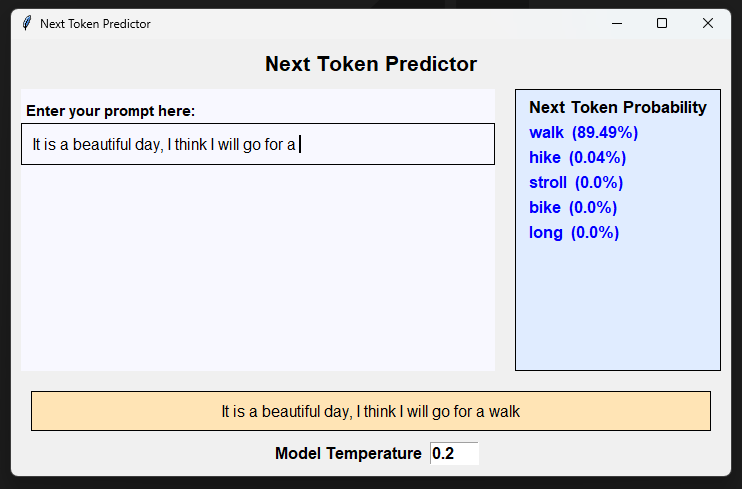

# Next Token Predictor

🚀 **Next Token Predictor**

A simple, interactive Python tool for predicting the next token in a text sequence using OpenAI's GPT model. This project is designed for educational purposes, NLP experimentation, and as a potential foundation for more advanced AI projects.



## Features

- 🧠 Predicts the next token in a user-provided text sequence
- Uses OpenAI's GPT model to predict the next token in your sequence
- Clean, user-friendly interface (see screenshot above)
- Easy to extend and customize for your own experiments

## Getting Started

### Note on Language Model Predictions

Unlike querying a database for specific records, using Large Language Models (LLMs) is fundamentally probabilistic. The model predicts the next token based on probability distributions learned from vast amounts of data—not with certainty or factual lookup. This means the results are the most likely continuations, not guaranteed facts.

That said, I’m thrilled that technology has advanced to this point! 😊 LLMs will continue to open up new possibilities for creativity and innovation—not only in software development, but also in project management, data modeling, marketing, medicine, and more. The potential applications are vast, even though the results remain probabilistic and are based on learned patterns rather than direct data retrieval.

### Prerequisites

- Python 3.8+

### Installation

1. Clone this repository:

   ```sh
   git clone https://github.com/m2web/next-token-predictor.git
   cd next-token-predictor
   ```

2. (Optional) Create and activate a virtual environment:

   ```sh
   python -m venv venv
   .\venv\Scripts\activate
   ```

3. Install dependencies (if any):

   ```sh
   pip install -r requirements.txt
   ```

### Usage

Run the predictor:

```sh
python next_token_predictor.py
```

Follow the on-screen instructions to input your text and see the predicted next token. The app will display the top predicted next tokens and their probabilities, as provided by the OpenAI model.

## Project Structure

```text
├── next_token_predictor.py                # Main application (OpenAI GPT-based predictor)
├── chat-bubble.py                         # UI/utility module
├── .gitignore                             # Git ignore file
├── .markdownlint.json                     # Markdown lint configuration
├── assets/
│   ├── final_next_token_predictor_ui.png  # UI screenshot
│   └── token-predictor.drawio.pdf         # Architecture diagram
```

## Contributing

Contributions are welcome! Please open issues or submit pull requests for improvements, bug fixes, or new features.

## License

This project is licensed under the MIT License. See [LICENSE](LICENSE) for details.

## Acknowledgements

- Inspired by classic NLP and AI research
- Also inspired by Scott Hanselman's demonstration of his next-token prediction app ([see him on GitHub](https://github.com/shanselman))
- UI design by [m2web](https://github.com/m2web)

---

🌟 _If you find this project useful, please star the repo!_
